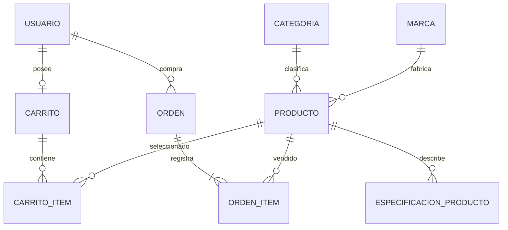

# Modelo relacional y justificación de 3FN

El modelo separa los hechos de catálogo, carro y venta. Las especificaciones se guardan como filas atómicas; los diccionarios que expone la API son una representación de esas filas, no una columna JSON del producto.

| Relación de negocio | Claves candidatas | Dependencias funcionales principales |
|---|---|---|
| Usuario | id, username | id → datos de usuario y rol |
| Categoría | id, nombre, slug | id → nombre, slug, descripción |
| Marca | id, nombre, slug | id → nombre, slug |
| Producto | id, SKU | id → nombre, categoría_id, marca_id, precio actual, stock, descripción, imagen, activo |
| EspecificaciónProducto | id, (producto_id, clave) | (producto_id, clave) → valor |
| Carrito | id, usuario_id | id ↔ usuario_id; id → fechas |
| CarritoItem | id, (carrito_id, producto_id) | (carrito_id, producto_id) → cantidad, fecha |
| Orden | id, numero_orden | id → usuario_id, estado, control de reposición, fechas |
| OrdenItem | id, (orden_id, producto_id) | (orden_id, producto_id) → cantidad, precio unitario de esa venta |

**1FN:** cada atributo de negocio ocupa un valor escalar; no hay listas de productos ni características repetidas dentro de una columna. Una orden con varios productos usa varias filas de OrdenItem.

**2FN:** para las claves compuestas de ítems y especificaciones, cada atributo depende de toda la combinación. La cantidad comprada y el precio pactado pertenecen al par orden/producto; no se almacenan nombres de cliente, categoría ni fabricante allí.

**3FN:** los datos descriptivos de usuario, categoría y marca se mantienen en sus relaciones, no se duplican a través de claves foráneas. Para las dependencias de negocio declaradas, todo determinante no trivial es una clave candidata; no hay dependencia transitiva de atributos descriptivos no clave dentro de las relaciones.

El precio histórico no duplica el mismo hecho que el precio actual: uno representa lo pactado en una venta y el otro la oferta vigente. Cambiar el catálogo no cambia `OrdenItem.precio_unitario`. El subtotal y el total de orden se calculan desde esos hechos y no tienen columnas persistidas que puedan quedar desactualizadas.

La bandera `stock_reincorporado` registra si se ejecutó la devolución. CANCELADO por sí solo no determina esa bandera: cancelar una orden pendiente no devuelve inventario, cancelar una pagada sí. Los estados terminales y el bloqueo de la orden impiden devoluciones repetidas.

El catálogo admite una sola fila por atributo de producto y el carro/orden una sola fila por producto, mediante restricciones únicas de PostgreSQL. Las FK protegen referencias históricas. Los CHECK impiden precios y cantidades inválidos y stock negativo.

La demostración se limita a estas dependencias del dominio y no confunde la normalización con concurrencia, seguridad ni rendimiento. La coordinación transaccional está en los servicios; la administración no permite editar los hechos de venta.
